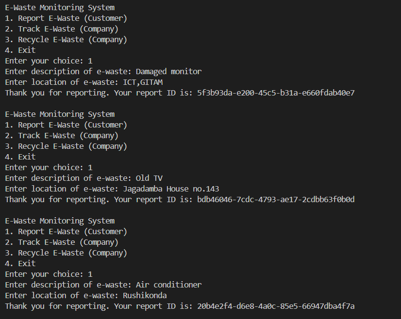
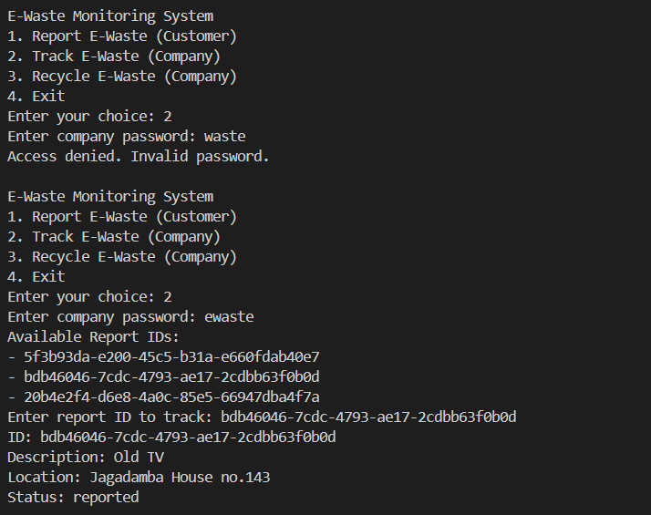
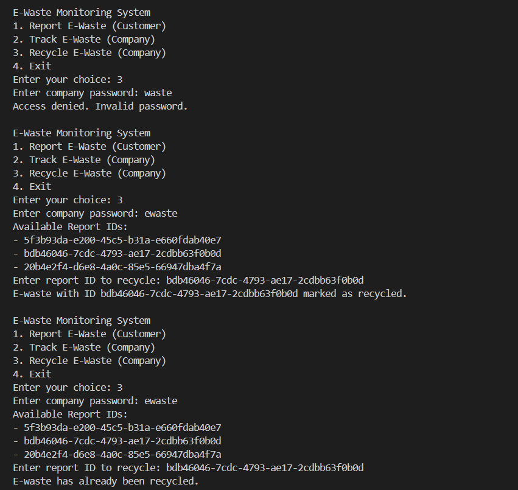

# E-waste-management-hackathon
A software platform that helps government and private organizations to collect, monitor and recycle E-waste.

## Overview
The E-Waste Monitoring System is a console-based application designed to facilitate the reporting, tracking, and recycling of electronic waste (e-waste). Customers can report e-waste, while company staff can track and recycle reported items. This system helps in managing e-waste efficiently and supports responsible consumption and production.

## Features
- **Customer Reporting**: Customers can report e-waste with a description and location.
- **Company Tracking**: Company staff can track the status of reported e-waste items (requires authentication).
- **Company Recycling**: Company staff can mark reported e-waste items as recycled (requires authentication).

  

## Usage
**1. Customer Reporting**:
- Select option 1 to report e-waste.
- Enter the description and location of the e-waste.
- Customer will recieve message that succesfully reported.

  

**2. Company Tracking**:
- Select option 2 to track e-waste.
- Only company staff can access this due to authentication.
- Enter the company password.
- If the password is correct, the system displays all report IDs.
- Choose the ID to track and details will be displayed

  

**3.Company Recycling**
- Select option 3 to recycle e-waste.
- Only company staff can access this due to authentication.
- Enter the company password.
- If the password is correct, the system displays all report IDs.
- Choose the ID to recycle and status will be displayed.
- If already recycled then it says 'E-waste has already been recycled.'

  

